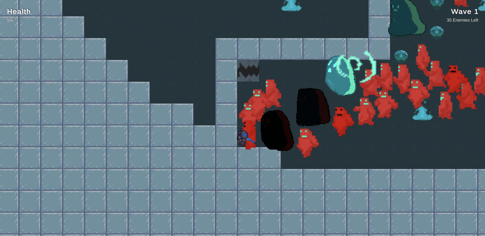

# GALACTIC GLADIATOR

Galactic Gladiator is a fast paced top down shooter with sci-fi elements. After your spaceship crashes and you are abducted by aliens, 
you must fight off wave after wave of enemies using a variety of unusual weapons in the gladiator arena!
How long can you survive?

## Controls
WASD - move    
Space - hold and release to teleport to the mouse cursor    
LMB - Primary attack    
RMB - Secondary attack    
Mouse - Aim   

## Screenshots

## Credits
Team Iron   
William Parsons - Programmer/Designer   
Liam Lennon-Flynn - Programmer/Designer   
Freeman Eckles - Programmer/Designer   
Samuel Hansard - Artist/Designer   

Music by TommyMutiu from Pixabay   
Music by Kinemesis_Music from Pixabay   
Music by Lesfm from Pixabay   
Music by Electronic-Senses from Pixabay   

Sound Effects from Freesound.org   
Sound Effects from Zapsplat.com